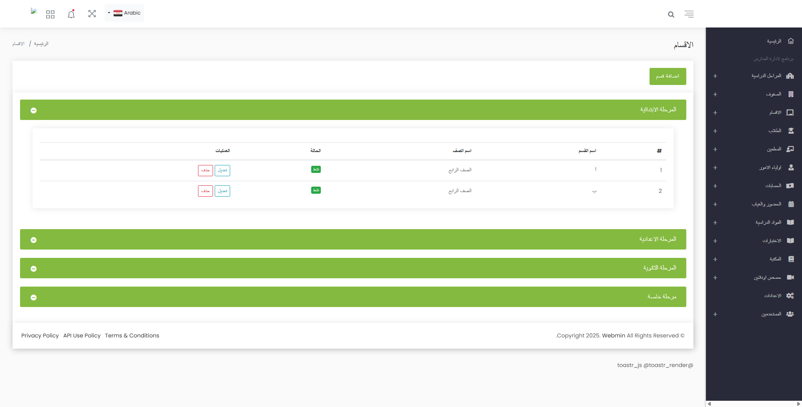

# 🎓 School Management System

A robust and modular school management system built with Laravel and Livewire, supporting role-based dashboards for Admins, Teachers, Students, and Parents.

## 🚀 Features

### 🔐 Multi-Role Authentication & Dashboards
Each user type has access to a dedicated dashboard with tailored features:
- **Admin**: Full control over the system including student promotions, accounting, and user management.
- **Teacher**: Create and manage exams, record attendance, and monitor student performance.
- **Student**: Access tests, view results, and request re-exams.
- **Parent**: Monitor their children's academic progress, attendance, grades, and financial dues.

### 🌐 Multi-Language Support
- Full support for **Arabic** and **English** interfaces.
- Users can easily switch the language from within the system.

### 🧩 Design Pattern
- Utilizes the **Repository Design Pattern** to keep code clean, modular, and maintainable.

### 🎥 Zoom Integration
- Admins and Teachers can schedule, manage, and hold online classes directly through **Zoom Integration**.

### ⚙️ Livewire Integration
- Real-time, dynamic UI powered by **Laravel Livewire** for seamless interactivity without full page reloads.

### 🎓 Student Promotion System
- Promote students from:
  - One grade to another
  - One class to another
  - One academic year to another
- Also supports graduating students.

### 💼 Attendance System
- **Teachers** can record daily attendance for each class.
- **Parents** can view their children's attendance history (dates of absence/presence).
- **Admins** have access to full attendance reports.

### 💵 Accounting Module
- Full accounting features for managing:
  - Invoices & fees
  - Payment status
  - Balance tracking (Debtor or Creditor)
  - Student-specific financial summaries

### 📝 Examination System
- Teachers can create and assign exams.
- Students can submit exams and receive immediate grading.
- Parents can view the performance of their children.
- Students can submit **re-exam requests** in case of issues.

## 🌄 Screenshots

> Add your images to the `/screenshots` folder in your repository and display them like below:

  

## 🛠️ Tech Stack
- **Laravel** (Backend)
- **Livewire** (Frontend interactivity)
- **Zoom API** (Online sessions)
- **Repository Pattern** (Code architecture)

## 📂 Structure
- Modular, scalable structure following best practices.
- Each module is separated and can be extended easily.

## ✅ Future Enhancements
- Notifications system for reminders and updates
- Mobile-friendly version

## 🧑‍💻 Developed by [Atef Hejazi](https://www.linkedin.com/in/atefhejazi)

Feel free to fork, contribute, or reach out for collaboration.
